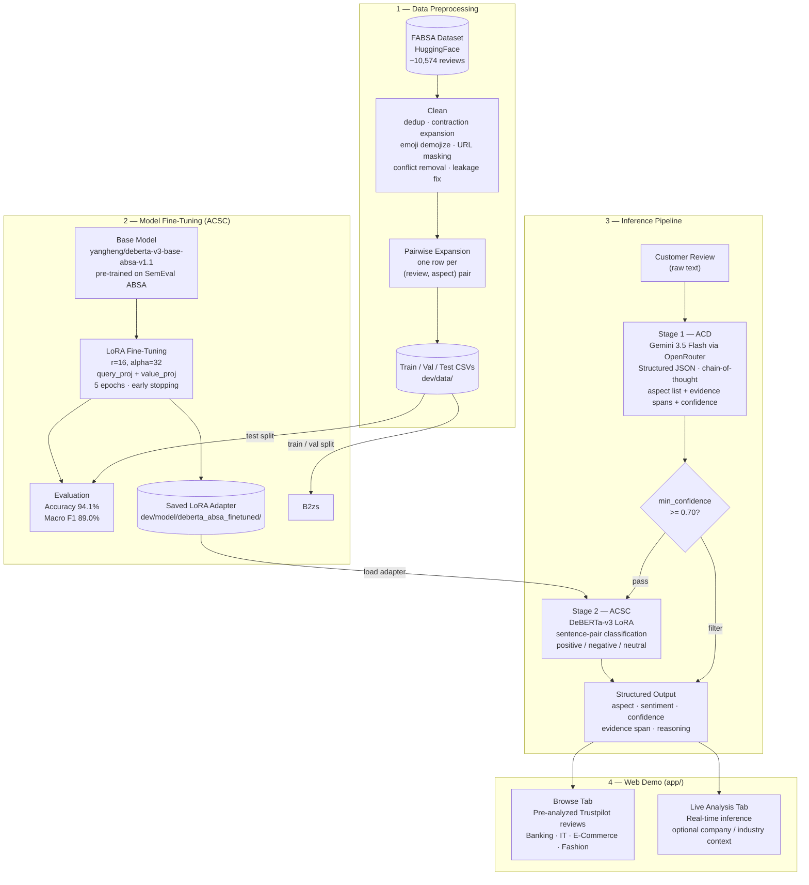

# System Architecture

## High-Level Pipeline

---

## Component Summary

| Stage | Component | Technology |
|---|---|---|
| Preprocessing | Clean + pairwise expand FABSA | Python · pandas · `contractions` · `emoji` |
| Fine-tuning (ACSC) | LoRA adapter on DeBERTa-v3 | HuggingFace PEFT · PyTorch |
| ACD (inference) | Aspect category detection | Gemini 3.5 Flash via OpenRouter |
| ACSC (inference) | Sentiment per detected aspect | Fine-tuned DeBERTa-v3 |
| Web demo | Browse + Live Analysis | FastAPI · vanilla HTML/JS |

---

## Why Two-Stage?

The ACD and ACSC tasks require fundamentally different strengths:

- **ACD needs world knowledge** — deciding whether *"I cannot log in"* maps to `account-management.account-access` requires understanding what a banking service is, not pattern matching. An LLM handles this through reasoning; a fine-tuned classifier memorises annotation noise.
- **ACSC needs precision** — given a specific aspect, classifying sentiment (positive / negative / neutral) is a well-scoped 3-class problem that a fine-tuned discriminative model handles with high accuracy (94.1%).

Splitting the tasks lets each component do what it is best at.
